# 合成（Layer-compositing）

今天无意看到一篇文章介绍了页面动画效果优化的文章[掘金：疯狂操作 CSS3 实现 60 FPS 动画效果，CodeReview 时同事直呼：细节！](https://juejin.cn/post/6980220327951335432))

本就对CSS比较薄弱的我决定深入研究一下到底**Composite**是什么。

# 像素管道

- **JavaScript**。一般来说，我们会使用 JavaScript 来实现一些视觉变化的效果。比如用 jQuery 的 `animate` 函数做一个动画、对一个数据集进行排序或者往页面里添加一些 DOM 元素等。当然，除了 JavaScript，还有其他一些常用方法也可以实现视觉变化效果，比如: CSS Animations、Transitions 和 Web Animation API。
- **样式计算**（Style）。此过程是根据匹配选择器（例如 `.headline` 或 `.nav > .nav__item`）计算出哪些元素应用哪些 CSS 规则的过程。从中知道规则之后，将应用规则并计算每个元素的最终样式。
- **布局**（Layout）。在知道对一个元素应用哪些规则之后，浏览器即可开始计算它要占据的空间大小及其在屏幕的位置。网页的布局模式意味着一个元素可能影响其他元素，例如 `<body>` 元素的宽度一般会影响其子元素的宽度以及树中各处的节点，因此对于浏览器来说，布局过程是经常发生的。
- **绘制**（Paint）。绘制是填充像素的过程。它涉及绘出文本、颜色、图像、边框和阴影，基本上包括元素的每个可视部分。绘制一般是在多个表面（通常称为层）上完成的。
- **合成**（Composite）。由于页面的各部分可能被绘制到多层，由此它们需要按正确顺序绘制到屏幕上，以便正确渲染页面。对于与另一元素重叠的元素来说，这点特别重要，因为一个错误可能使一个元素错误地出现在另一个元素的上层。

上面每一个步骤都可能会产生渲染性能而造成卡顿，所以，确定代码触发了管道哪一部分十分重要。

## 页面如何从文件到用户看到的画面

1. 下载html文件以及相关的css文件并解析成**Dom Tree**

   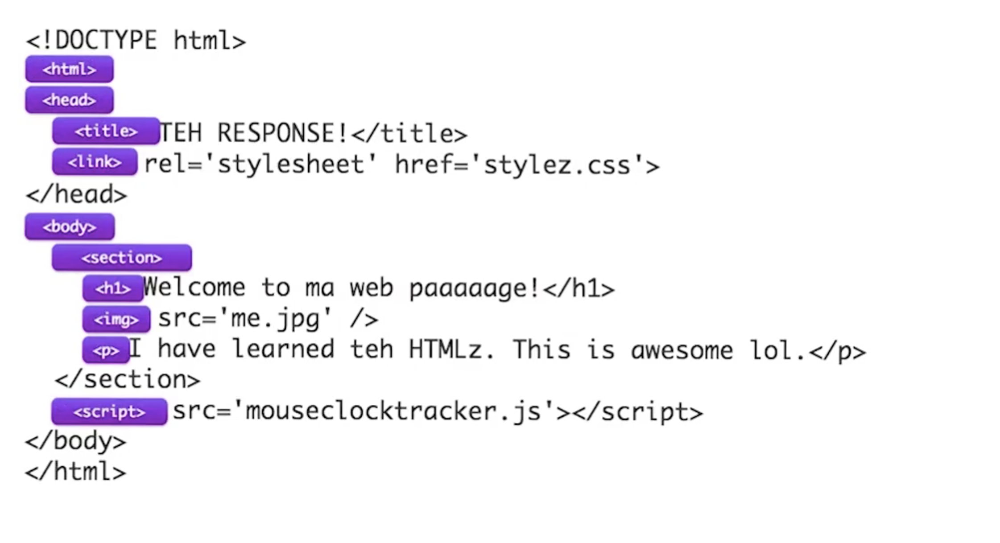

2. `Dom`+`CSS`生成`Render Tree`，也就是Compputed style里的内容；那么干了什么呢？1）解析不显示的dom-node，将其从tree里删除，2）解析伪类的content，插入新的dom-node。注意里面去掉了与页面样式无关的`<header>`和`<script>`标签，因为这些在获取样式之后和dom并没有任何关联。

   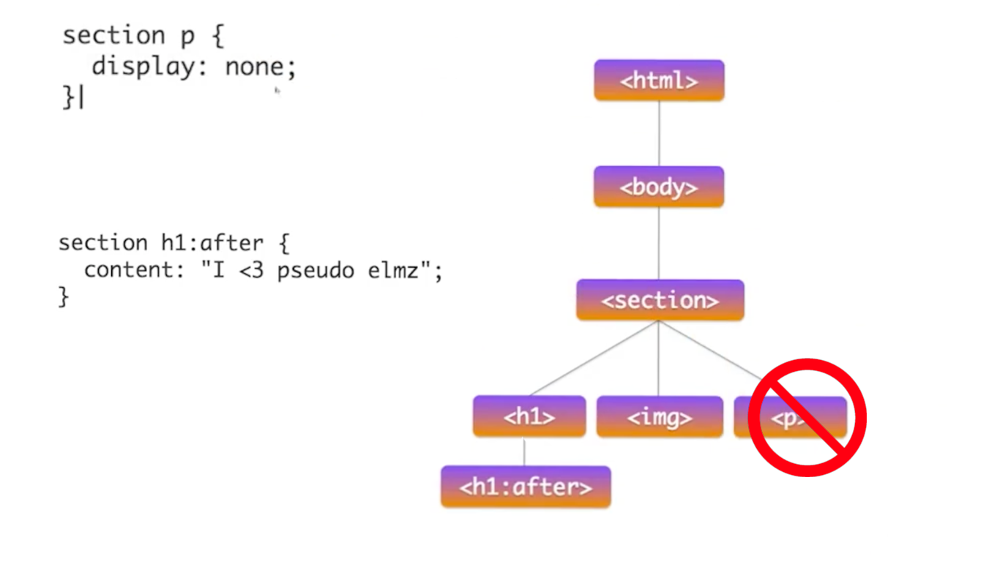

3. 根据`Render Tree` + `CSS`解析出Layout，也就是几何内容、盒子关系。当其中一个环节更改，影响相关元素，并且将影响从上（根）至下（叶子）传递而形成布局变化的过程也被为**Reflow** ，也就是**回流**。

   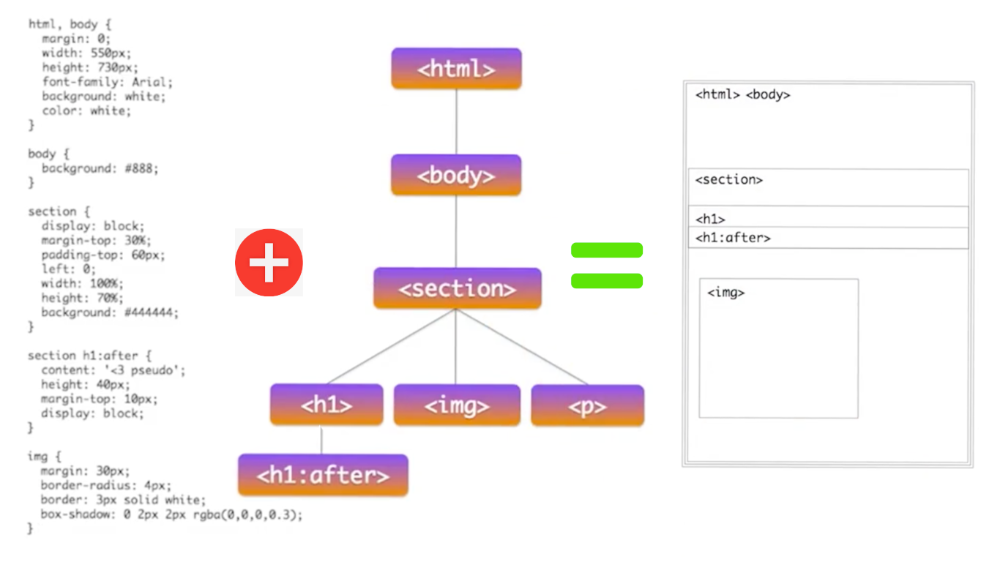

4. **Painting**，这时将**Render Tree** 光栅化绘制，以便填充为**图层**。

+ 光栅化就是将**矢量图形**（左）通过光栅器填充为单个像素，形成**位图**（右）

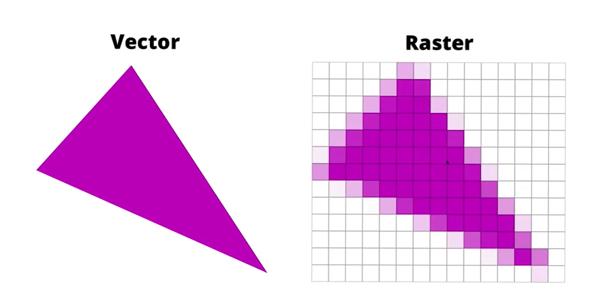

+ 那么回到刚才的简易代码，光栅器是如何执行的呢？

+ 最后，绘制出一个**图层**

5. **Composite**，将解析出的图层进行增量渲染。图一图层，即便是微小的改动，也会整个渲染，而组合这些图层便是性能优化中的关键。

# 帧率优化-Composite

+ 那么影响帧率的关键就在于你的“改动”都是影响了哪些步骤并引起了那些连锁反应。
+ 我们来看一张各个样式属性会触发的像素管道阶段的表格

[表格全文]([CSS Triggers](https://csstriggers.com/))

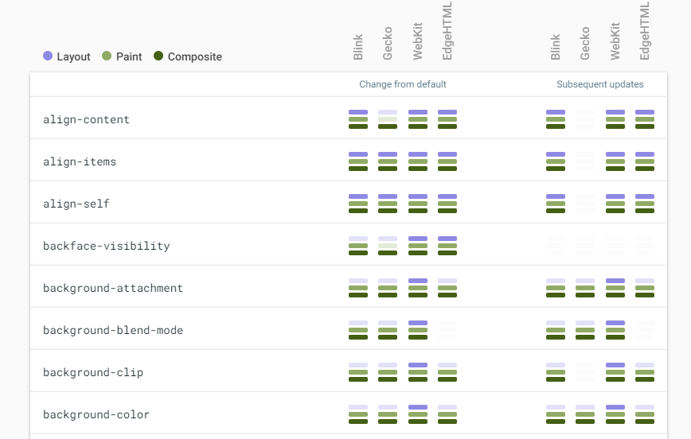

**下面是两个例子介绍如何使用性能检查工具（Performance）调试和修改引起性能问题的代码**

我们直接深入代码优化，以github的一个仓库为例子[仓库地址]([udacity/news-aggregator at gh-pages (github.com)](https://github.com/udacity/news-aggregator/tree/gh-pages))，并不需要提交读懂代码，我们从性能检查工具入手

跑起代码之后，我们看到的是这样一个界面：

## 减少无意义的几何改变

1. 打开**F12**，选择**Performance**标签，按**Ecs**打开控制台，添加**Rendering**标签

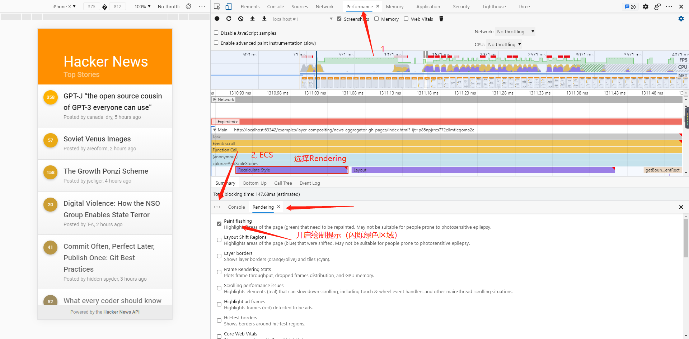

2. **滚动**录制一段时间线（以前叫TimeLine现在叫Performance），可以看到帧率及其糟糕，有大量的红色标记

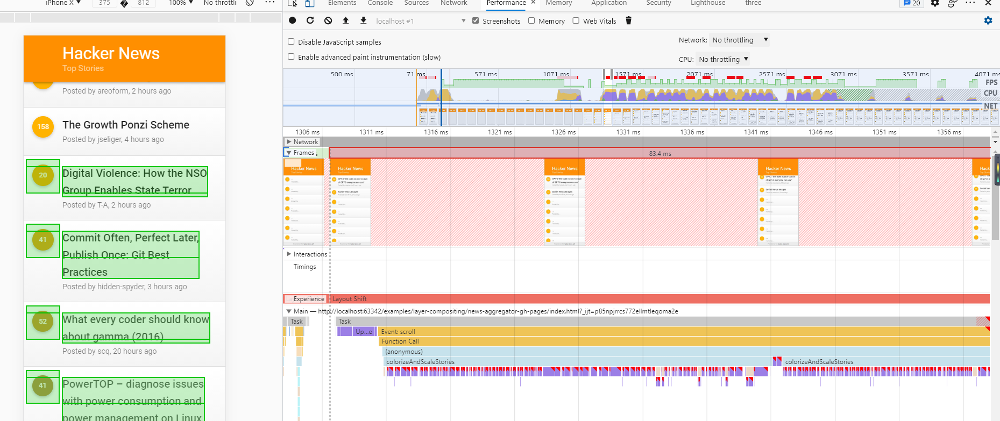

3. 展开渲染细节我们发现有大量的强制布局同步引起的回流（Force synchronous layout -> Force Reflow），而调用堆栈显示是**colorizeAndScaleStories** 引起的

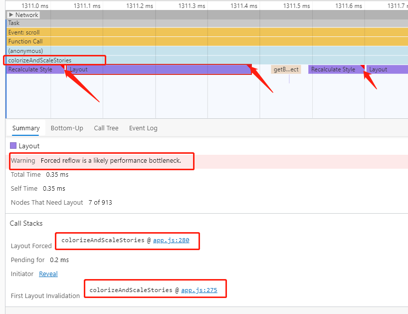

4. 进入到**colorizeAndScaleStories**内部，我们发现有js在实时的更改这dom的宽高

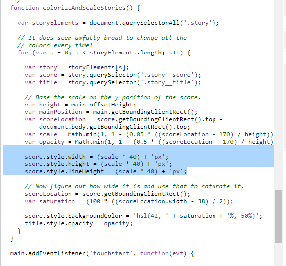

而从上面的触发对比表格里我们知道Width，Height是全触发！

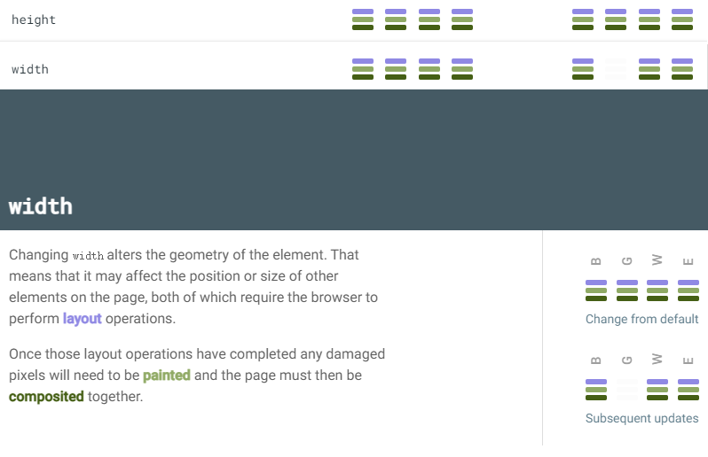

这个函数的功能是计算每一条新闻的位置，将屏幕下半截的左边计数圆盘改变颜色、大小并且在改变之后保持行内上下居中。从需求角度讲根本没卵用，但是对页面的性能有极大的伤害，那就直接干掉，然后看效果。

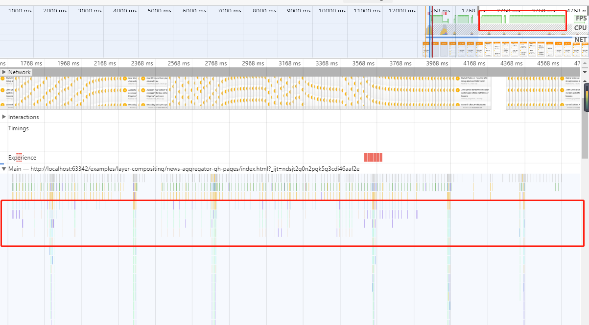

对比刚才每帧一个回流操作简直赏心悦目，帧率也明显提升，棒！

## 动画请尽量使用CSS实现

点击一条消息，查看详情（消息详情像menu一样滑入滑出）

我们看到这里有异常多的Layout引起的回流。

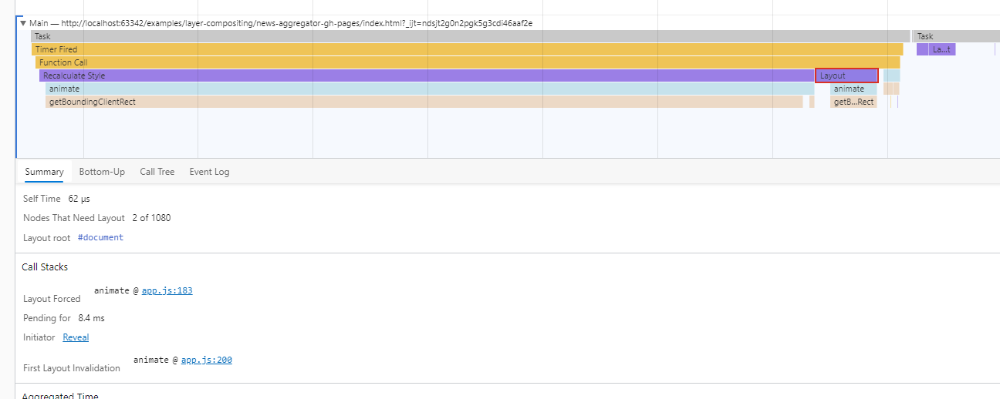

展开细节我们可以看到这里是由一个叫做**animate**方法引起的。

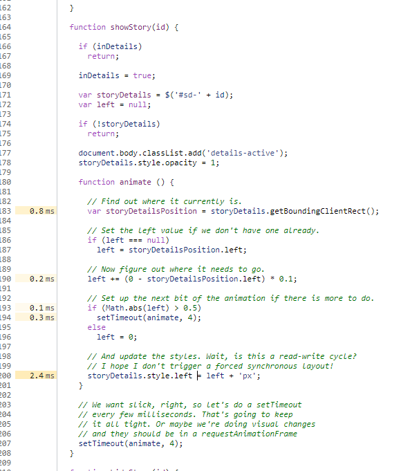

不看不知道，一看吓一跳，里面竟然用js递减确定位置，还用的是settimeout，即便是如此也应该用**requestAnimationFrame**是吧。

+ 过一遍完整逻辑，通过点击消息调用showStory 来调用showStory，点击 图标`X`调用hideStory，两个都调用animate对left进行加减控制滑块位置。

+ onStoryClick时，bing对应的id到showStory和hideStory，并settimeout执行，在执行期间，创建一个滑块的Dom插入body（但是没有删除，这回浪费性能和内存）。

那目的就很简单了：

+ 直接创建一个节点以供选择新闻内容后进行内容填充。

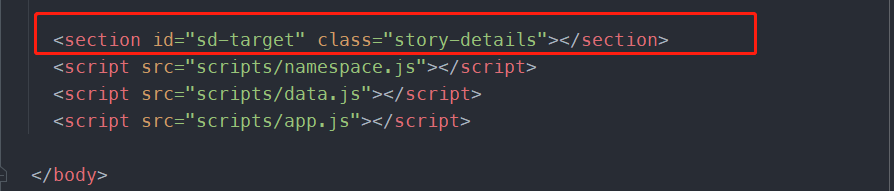

+ 动画改用css实现。

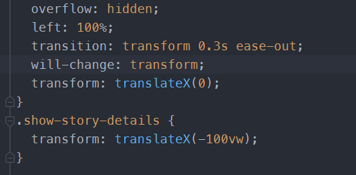

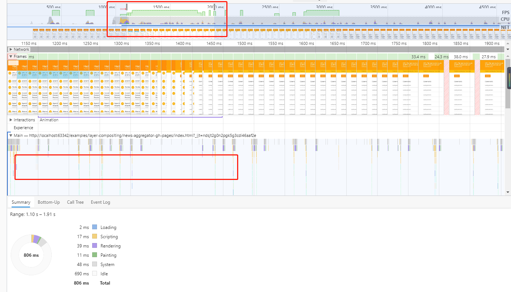

最终结果表示，滑入滑出的动画也能60帧运行了，丝滑无比。

# 总结

在编写交互和动画时，很容易就能触发**重排、回流和重绘**操作，以造成糟糕的性能体验。熟悉渲染的各个阶段，并且知道如何在各阶段避开错误的写法就能写出流畅丝滑的页面。

# 资料汇总

+ Google官方讲解视频 [浏览器渲染优化 - Udacity](https://classroom.udacity.com/courses/ud860/)
+ [渲染性能  | Web  | Google Developers](https://developers.google.com/web/fundamentals/performance/rendering)
+ 视频配到学习代码仓库 [demo](https://github.com/udacity/news-aggregator/tree/gh-pages)

+ v8 will compositing reasons source code [compositing_reasons.h - Code Search (chromium.org)](https://source.chromium.org/chromium/chromium/src/+/main:third_party/blink/renderer/platform/graphics/compositing_reasons.h)

+ 图层和Composite： [CSS GPU Animation: Doing It Right — Smashing Magazine](https://www.smashingmagazine.com/2016/12/gpu-animation-doing-it-right/)

