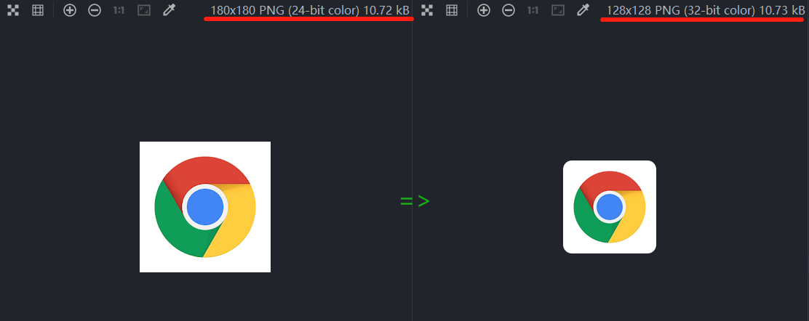

# picture-resize

[中文说明](./README.zh.md)

Batch process images size and radius, convert the images from directory `images`
to the directory `dist/${size}`




## Installation

Based on [sharp](https://github.com/lovell/sharp/tree/master) library
requires `gyp`, `python`, `vs-builder-tools` environment, install the
corresponding environment according to the error message

## Usage

+ core code

```js
sharpe('input.png').resize(192).png()
```

1. Prepare some pictures, put them under directory `images`, and modify the
   cut.js script.
2. `node cut.js`
3. Change the size and radius by default to use it out of the box 
